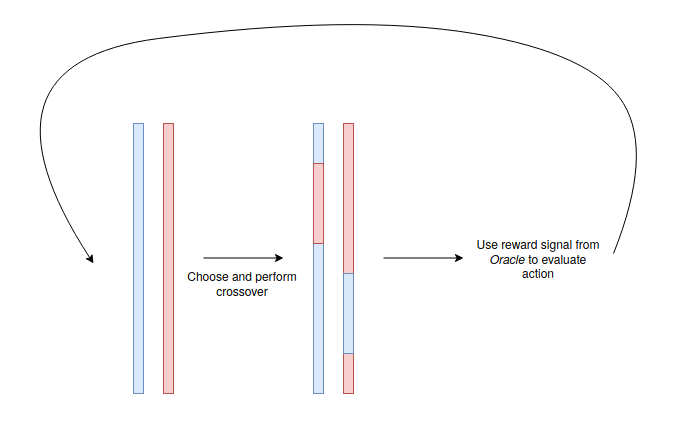
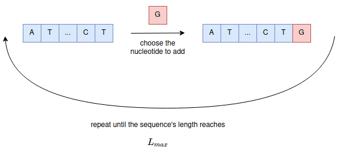

### Asynchronous Advantage Actor-Critic (A3C) to generate DNA sequences

### Introduction

###### 1. Description

Generating relevant and unseen DNA sequences is a necessity to understand and interpret our *Oracle* network. In this document, we suggest a new approach among the DNA sequences generation methods.

The idea comes from the Genetic algorithm (GA), the relatively good performance of this model gave us the insight that repeated crossover is a good path to DNA sequence optimization. The arbitrary part (crossover defined beforehand) is frustrating though.  There is a lot of arbitrary of random choices during the the process of the Genetic Algorithm, this is an issue because we can't guarantee that we are getting closer to the optimum with the number of iteration and that the model is improving with time, one of the consequences of this is that the model is hard to compare with papers using reinforcement algorithm [Google] or sampling based technique [Listgarden]. On the other side the fact that the GA is yielding very convincing results in term of motifs even in difficult optimization problems (Uncertain oracle and space bigger that the one tested in most of the concurrent papers) is encouraging and give us the intuition that it would be interesting to exploit techniques relying on crossover. We want our model to make its choices based on the previous ones and to learn a decision making model that we could use for interpretation secondly. That's why we thought that using Reinforcement Learning framework could perfectly fits our goals.

RL framework has shown being very efficient regarding decision making problem. With a robust definition of the framework components, we have the strong feeling this thrilling optimization matter can be addressed using Reinforcement Learning. Especially, one of the main challenge of this set of task is to navigate on the thin line between "exploration" and "exploitation" in order to find both diverse and and efficient solutions. Recent improvements on Policy Gradient (*PG*) and in particular Actor-Critic (*AC*) algorithm demonstrate the latter outperforms value-based methods. The strong advantage of PG is its ability to learn stochastic policy and to sample from the learned probability distribution to perform its actions (*On-Policy algorithm*). This way, the panel of good possibilities to be chosen will not be affected by the algorithm. Thus and most importantly, the model will not converge to a single high rated sequence. More on exploitation-exploration trade-off is discussed in the algorithm description. 

In the algorithm_description document I give a detailed description of the algorithm, but first, let's explain the outlines. This algorithm aims at optimizing a random DNA sequence so that it maximizes the *Oracle* return. So at each time step, we modify our sequence and we call the *Oracle* for feedback. These optimization's approaches differ from generation's ones (*i.e  generate one nucleotide at each iteration*).  You will find more about that below (Method Justification) but we want to show that crossover based ans thus optimization approach is well fitted here. As you may guess, the DNA sequence will be modified by crossovers, eventually our agent will learn to perform good crossover circumstantial (*i.e based on the sequences' couple*). As it is a continuous task, the sequence optimization will stop once the reward stagnate for an arbitrarily defined duration or reach a target value.  

 

###### 2. Related work

**Model-based reinforcement learning for biological sequence design**

*https://openreview.net/pdf?id=HklxbgBKvr*

In September 2019, Google suggest a RL-based method to generate DNA. This approach is a generation's one, at each time step the model will choose a nucleotide (*i.e {A, T, G, C}*)  to stack on top of the current branch. So based on the current incomplete sequence, the model will try to find the right nucleotide to set afterward. 

###### 3. Method justification

In this section, we will justify our choices and explain why we think our approach is efficient. At first, we want to clearly emphasize on the fact that recent RL has proven to be able to learn complexe structure, largely driven by the neural network paradigm. (Universal approximation theorem)

**Comparison with related techniques** 

We both have the strong conviction that manipulate our sequences bloc-wise is a very efficient way compare to nucleotide-wise. Indeed, DNA interpret  information not as whole but sequentially. This intuition seems actually confirmed by practical results : when we run the GA with different crossover size we observer consistently a better performance of the 19 bp block crossover. 

Hence our will to stand out from Google approach. We believe out Genetic Algorithm has relatively good result thanks to his unit-wise modification. As mentioned, we want to add artificial decision making to this system. We divert from the GA approach in a sense because we are not using a whole population but a single DNA sequence. This choice is driven by multiple reasons. The first and most obvious one is to relieve our RL model from a lot of information to handle. The agent will make assumption taking 2 sequences whether than a N-sized population. Also, in terms of *Oracle*'s call, each of them will be used for the following decision. This bootstrapping method gains the maximum potential of our *Oracle*. As shown on the figure below the number of sequence evaluated by the Oracle during the generation process is the core comparison of the papers we are comparing with. Thus, optimizing the sequences with a minimal number of step and using only two evaluations by step is a key asset to increase the credibility of our technique. 

**Interpretation advantages** 

Concerning interpretability, our algorithm will try to model the cross over action with respect to *Oracle* evaluation. From a biological point of view, a real interpretation on crossover effect leading to new assumptions is a possible outcome. On top of that, having a natural link (*i.e the crossovers*) between our model and biology could make the *Oracle* interpretation a lot easier.  Crossover based technique have a strong advantage regarding interpretability has it is linked to our current vision of the activity regulation mechanisms, by "forcing" the generated sequences to rely on motifs / large blocks to optimize the objective we increase the chance to find interesting motif but also importantly decrease the chances to build adversarial examples : in substance the generated sequences not only have to be a set of nucleotide that maximize or objective but also to be composed by subset of nucleotides that locally have an impact. 

### Algorithm description

The algorithm_description.md annex describes precisely all the components regarding the solutions we are offering. In a nutshell, to give you a brief overview of the algorithms details:

- Markovian Decision Process (*MDP*)

**State**: the sequence's couple, the one to be optimized and the other to perform cross over with. 

**Actions**: A crossover defined by 3 values (length and starting point in both branches).

**Rewards**: The *Oracle* output value.

**Transition Function**: deterministic with respect to the action. 

- Algorithm 

A Asynchronous Advantage Actor Critic (*A3C*) algorithm. Might be associated with Proximal Policy Optimization. 

- Function Approximation

**Actor**: RNN network to select each action component (*i.e length, and starting points*) sequentially.

**Critic**: Basic feed forward network outputting a (1, )  value shaped. 

- Feature Engineering 

Use latent space of the *Oracle* to retrieve more meaningful representation of the state. 

- Exploration

Entropy penalty in the first place, and suitable version of the $u$ function used in AlphaGo could be implemented if entropy penalty is not sufficient. 

- Differences in each action component dimension

We might want to have different action-value range (*e.g forcing crossover length to be included between 15 and 20*), but neural network architecture are fairly rigid. To overcome this aspect the option,our choice is to penalized and remove effect on unwanted action. 

